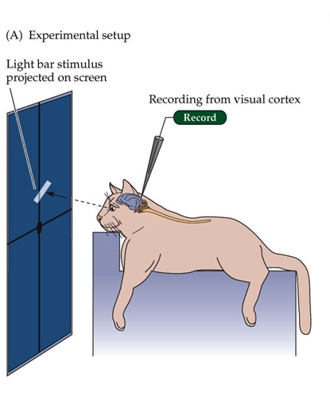

# Lecture 4

# 4.1 - Edge Detection

Edges are important features for image analysis. We can think of edges as significant local changes in an image, which happen at the boundary between two different regions of the image. Historically, a common way to represent edges is through lines and line drawings since they provide a way of communication and contour expression. Lines and edges convey meaning about scenes and edges, a fact that is supported by studies in neurobiology that found that the mammalian brain responds especially strongly to the stimuli presented by images of some line configurations.

  
  
Hubel & Wiesel experimental design

*Hubel & Wiesel, 1960s*

Further studies have revealed that human brains interact similarly with edges. Further, from human perception studies in psychology, we know that not all edges are equally important in terms of communicating meaning; some edges are more significant than others. These studies have inspired the use of edge detection in Computer Vision. By detecting edges, we hope that we can recover information regarding objects in the image as well as the geometry and viewpoint of the scene. 

## The End Goal
The goal of edge detection in computer vision is to identify sudden changes (discontinuities) in an image. In general, the ideal functionality of an edge detector is to convert any photo input into a line drawing -- ideally, what a human artist would draw to represent the input. In the case of the human artist, the creation of this drawing requires the use of external knowledge and inference about the depicted object in order to either _add_ lines that are not present in the image, or to _remove_ lines that are apparently present in the image, but stylistically irrelevant.

  
  
Edge detection example

*Image Credit: Computer Vision with Python 3 by Saurabh Kapur*

Notice that in this computer-generated image, there are both missing edges and extra edges that a human artist would not miss / draw.

An ideal edge detector would be useful for:
* Detecting primary objects and removing background noise
* Applying further techniques to extract more exact geometric definitions of said objects

Edge detection techniques aim to approach this ideal goal, but are met with some challenges.
## Types of Edges
What defines an Edge? A few examples of geometric structures that produce "edges" are:

* Two surfaces that meet at a sharp angle (surface normal discontinuity)
* Two surfaces that are at different distances from the viewer, but appear next to each other in the image (depth discontinuity)
* A surface that changes color sharply at a point (color discontinuity)
* A structure whose surface lighting changes sharply at a point (illumination discontinuity)

  
  
Types of discontinuities

A general theme we observe here is that _some kind of sharp discontinuity_ may be a key into identifying which pixels of a given image are parts of edges.

# 4.2 - Edge Detection Image Gradients
Image gradients, or derivatives, are tools for us to compute edges in an image. This is because calculating the derivative can show us the areas in an image where there is an abrupt change (i.e. an edge). This section will cover derivatives in 1D and 2D, as well as discrete derivatives for images. 

## Discrete derivative in 1D (Review)
As a review, derivatives in 1D can be represented as the following:

$$\frac{\partial f}{\partial x}=\lim_{\Delta x \to 0} \frac{f(x)-f(x- \Delta x)}{\Delta x} = f'(x) =  f_{x}$$

However, let's remember that images are discrete functions rather than continuous functions. 

We can approximate a 1D discrete derivative in a few different ways.
1. Backward:  $\frac{\partial f}{\partial x} = f(x) - f(x-1)=f'(x)$
2. Forward: $\frac{\partial f}{\partial x} = f(x+1) - f(x)=f'(x)$
3. Central: $\frac{\partial f}{\partial x} = f(x+1) - f(x-1)=f'(x)$

We can also implement each of these approximations of derivatives as filters with convolutions:
1. Backward filter: $\begin{bmatrix}0 & 1 & -1\end{bmatrix}$
2. Forward filter: $\begin{bmatrix}1 & -1 & 0\end{bmatrix}$
3. Central filter: $\begin{bmatrix}1 & 0 & -1\end{bmatrix}$

**Example**:
Given a 1D function, $f(x)$, we can compute 1D discrete derivative using Backward approximation as follows:

$$f(x)  = \begin{bmatrix}10 & 15 & 10 & 10 & 25 & 20 & 20 & 20\end{bmatrix} \\
f'(x)= \begin{bmatrix}10 & 5 & -5 & 0 & 15 & -5 & 0 & 0\end{bmatrix}$$

Here, $f'(x)$ is calculated using backward approximation where $f'(x_i) = f(x_i) - f(x_i-x_{i-1})$:

$f'(x) = \begin{bmatrix}(10-0) & (15-10) & (10-15) & (10-10) & (25-10) & (20-25) & (20-20) & (20-20)\end{bmatrix}$

## Discrete derivative in 2D
Images are 2-dimensional discrete functions, so let us understand how to compute such functions.

Let there be a function $f(x,y)$, which is two-dimensional and has two parameters $x$ and $y$. In this case, when we think of derivatives, we are actually thinking about gradients since it is a multivariate function. Therefore, the generalization of derivatives are gradients. 

Given a function $f(x,y)$, its **Gradient vector** is given by

$$\nabla f(x,y)=\begin{bmatrix} \frac{\partial f(x,y)}{\partial x} \\ \frac{\partial f(x,y)}{\partial y} \end{bmatrix} =\begin{bmatrix} f_x \\ f_y \end{bmatrix}$$

The **Gradient magnitude** is

$$|\nabla f(x,y)| = \sqrt{f_x^2 + f_y^2}$$

The **Gradient direction** is

$$\Theta = \tan^{-1}{\left(\frac{\frac{\partial f}{\partial y}}{\frac{\partial f}{\partial x}}\right)}$$

We can summarize the derivatives in a gradient vector, where each component is the derivative of the function along one of the dimensions.

Additionally, we can compute how strong the derivative is by computing the gradient vector's magnitude. We can also compute the gradient orientation, which tells us the direction along which the gradient is strongest. If we move in this direction, the rate of change of our function will be higher than if we moved in any other direction.

## 2D Discrete Derivative Filter

To compute 2D gradients, we need filters. 

This filter computes the derivative along the x-direction.
 
$$1/3\begin{bmatrix} 1 & 0 & -1 \\ 1 & 0 & -1 \\ 1 & 0 & -1 \\ \end{bmatrix}$$

The following filter would compute the derivative along the columns, so it is computing an approximation along the y-direction. 

$$1/3\begin{bmatrix} 1 & 1 & 1 \\ 0 & 0 & 0 \\ -1 & -1 & -1 \\ \end{bmatrix}$$

### 3 x 3 Image Gradient Filters

Let's see an example of gradient filters applied to an image.

  
  
Gradient Filter Examples

For the middle image, it is notable that the values that are strongest in this picture are those that have strong changes in the horizontal axis. There is a similar effect applied to the third image in the direction of the vertical axis. 

# 4.3 A Simple Edge Detector

We have thus far gained a knowledge of what might characterize an edge, and what techniques we might use to calculate those features. We now outline a simplistic way of drawing out edges in practice.

## Characterizing Edges
Let's define an edge as _a sharp change in the local gradient of the image intensity_. Here is a visualization of what this means. 

  
  
Determining edges with intensity changes

In the left portion, we see a binary image consisting of black and white pixels. In the middle portion, we see the intensity value of the pixels along the horizontal scanline. In the right portion, we see the derivative of this intensity function taken along this scanline. We can easily see that the edges in the left portion of the image correspond to sharp changes in the derivative function seen in the right portion. While this is a simple example, the intuition remains the same for more complex images. We can generally identify edges through sharp changes in the local gradient.  Now, let us define the "local gradient" at a pixel as the vector:

$$\left[\frac{\partial f}{\partial x}, \frac{\partial f}{\partial y}\right]$$

We can see that this vector represents the local value of the rate of change of the intensity along both axes as seen in the image below. 

  
  
Edges and corresponding gradient vectors

The _direction_ of the gradient is found as:

$$\Theta = \arctan{\left(\frac{\frac{\partial f}{\partial y}}{\frac{\partial f}{\partial x}}\right)}$$

The gradient vector always points toward the direction of the fastest change in intensity. This entails that the direction of the gradient is always perpendicular to the direction of the edge. That is to say, for vertical edges the fastest change in intensity occurs in the x-direction and vice versa for horizontal edges.

Finally, the _strength_ of the candidate edge at a point may be expressed as the magnitude of the local gradient (i.e. how fast the intensity changes at the point):

$$||\nabla f|| = \sqrt{\frac{\partial f}{\partial x}^2 + \frac{\partial f}{\partial y}^2}$$

In review, we might go about this calculation by following this process:
* Convolve the image with one of the aforementioned x-derivative filters to get a map of the x-gradient
* Convolve the image with one of the aforementioned y-derivative filters to get a map of the y-gradient
* Create a third map by taking the root of the sum of the squares of the intensities of our two gradient maps

This is almost a functioning edge detector! Poor, but functional.

  
  
Creating an edge map

*Source: Lecture 4.3, slide 6*

#### NOTE: Be aware of which direction the axes point; in image processing, the y axis often points down.

A significant problem is found when we encounter noisy inputs. Discrete derivatives get "confused" by noise, in that local pixel-to-pixel rates of change in the intensity can be quite uniformly high. Noise can make it appear as if there’s a lot of change happening in the image, even in homogenous regions. The detection of edges is, therefore, quite hard (because _almost everything_ is an "edge"). What can we do?

## Smoothing + Magnitude of Gradients = Edge Detector!

Knowing that noisy input is the bane of our magnitude of gradients strategy, we first apply a smoothing kernel. Remember the weighted average kernel from a few lectures back?

$$1/9\begin{bmatrix} 1 & 1 & 1 \\ 1 & 1 & 1 \\ 1 & 1 & 1 \\ \end{bmatrix}$$

We can also use a slightly more advanced kernel, the gaussian smoothing kernel", which emphasizes the weight of the center pixel itself more than that of its neighbors:

$$1/9\begin{bmatrix} 1 & 2 & 1 \\ 2 & 4 & 2 \\ 1 & 2 & 1 \\ \end{bmatrix}$$

The updated process would then look like this:
* First convolve the image with a smoothing filter, THEN:
* Convolve the smooth image with one of the aforementioned x-derivative filters to get a map of the x-gradient
* Convolve the smooth image with one of the aforementioned y-derivative filters to get a map of the y-gradient
* Create a third map by taking the root of the sum of the squares of the intensities of our two gradient maps

To complete the line detection routine, we can apply a threshold to the magnitude map.

### Caveat

Using a smoothing filter has side effects, of course; the primary one being that the "resolution" of features, principally edges, in the image will be worsened. It stands to reason that the smoother the image becomes, the wider and blurrier the edges will become. A balance must be maintained concerning the smoothing applied to the input.

  
  
Smoothing and Localization Tradeoff

*Source: Lecture 4.3, slide 16*

## Designing an optimal performance edge detector

When building an edge detector, our goals are to:
* Minimize the probability of both false positives (i.e. "edges" that are actually an artefact of noise in the image) and false negatives (i.e. failing to detect an edge)
* Localize the edges as closely as possible to their true locations
* Return only one point corresponding to each true edge point 

In the following sections, we will review more sophisticated methods of edge detection that address these design principles

# 4.4 Sobel Edge Detector
Sobel edge detection involves the use of a special filter named the Sobel filter (or operator). It integrates many aspects we have learned such as gradient filters and Gaussian blurs. It is assumed that the input image we are working with is a greyscale image since this edge detection measures differences in intensity.

## The Sobel Filters
We have two 3x3 filters to compute the image gradient in the x and y directions

$$G_x = \begin{bmatrix} +1 & 0 & -1 \\ +2 & 0 & -2 \\ +1 & 0 & -1 \\ \end{bmatrix}\ \ \ \ \ \ G_y = \begin{bmatrix} +1 & +2 & +1 \\ 0 & 0 & 0 \\ -1 & -2 & -1 \\ \end{bmatrix}$$

If we look closely, the filter is actually combining a Gaussian blur and a gradient filter

  
  
Filter as vector product

The Gaussian smoothing is used to reduce noise in the image, and the differentiation filter is used to compute the gradients in the corresponding direction.

## Direction and Magnitude
As we have seen in image differentiation, we can also obtain the magnitude and direction of our gradients via the following

**Magnitude**:

$$ G = \sqrt{G_x^2 + G_y^2}$$

**Angle or direction of the gradient**:

$$\Theta = \arctan{\left(\frac{G_y}{G_x}\right)}$$

## Example

  
  
Sobel Filter example

We convolve $G_x$ and $G_y$ on an input image $F$ to get a gradient image in both directions. 

We combine these two output gradient images together by using our magnitude formula on our convolved outputs and then finally use thresholding (a parameter to determine what value constitutes an edge) to get an edge map of our input image.

## Caveats
As we have seen, there are a number of problems with this simple edge detector:

Poor localization
* There could be multiple responses to a single true edge

Thresholding bias
* Can favor certain values or directions
* Can miss oblique edges more than in the x or y directions
* False negatives (misses edges entirely)

# 4.5 Canny Edge Detector
The Canny edge detector is the most widely used edge detector in computer vision. Canny's approach satisfies many of the optimal design principles that we spoke about in section 4.3: low error rate, precisely localized edges, and a single response corresponding to each true edge.

## Steps of Canny Edge Detection
* Suppress noise
* Compute gradient magnitude and direction
* Apply non-maximum suppression 
* Use hysteresis and connectivity analysis to detect edges

Steps 1 and 2 are similar to what we have seen in our previous attempts at edge detection. As before, these can be done in a single step using the derivative of a Gaussian filter:

$$G_x = \begin{bmatrix} 1 \\ 2 \\ 1 \\\end{bmatrix}\begin{bmatrix} 1 & 0 & -1 \end{bmatrix} = \begin{bmatrix} +1 & 0 & -1 \\ +2 & 0 & -2 \\ +1 & 0 & -1 \\ \end{bmatrix} $$

$$G_y = \begin{bmatrix} 1 \\ 0 \\ -1 \\\end{bmatrix}\begin{bmatrix} 1 & 2 & 1 \end{bmatrix} = \begin{bmatrix} +1 & +2 & +1 \\ 0 & 0 & 0 \\ -1 & -2 & -1 \\ \end{bmatrix} $$

  
  
Computing gradients wiht the Derivative of Gaussian filter

## Non-maximum suppression
The issue with the gradient magnitude that we have obtained after steps 1 and 2 is that for every edge, there are multiple pixels.

  
  
Problem with Gradient Magnitude

Therefore, we need to apply non-maximum suppresion over the gradient magnitude to remove these spurious responses and find a single point for each true edge. 

We start from the premise that an edge occurs where the gradient reaches a max value. Our task is to remove spurious responses by comparing the pixel against its neighbors along the direction of the gradient and then removing the pixels that are not the maximum. 

Where $|\nabla G| (x, y)$ is the gradient at pixel $(x, y)$:

  
  
Non-Max Suppression

We calculate which of the three pixels along the direction of the gradient (i.e. the direction perpendicular to the edge) is the largest. The value of the other two pixels is then set to 0.

Sometimes, the gradient orientation doesn’t directly point to a neighbour pixel. In this case, we need to use interpolation among the neighbours to calculate the intensity value before finding the max. 

  
  
Interpolation in Non-Max Suppression

## Hysteresis thresholding
Finally, we need to use a threshold to produce the edge pixels. Using a single threshold is not optimal, however, because we may miss edges if we set the threshold too high or low. Hysteresis helps us avoid that!

Our goal is to avoid breaking up edges whose gradient magnitude is close to the threshold. To do so, we define two thresholds: low and high.

If low threshold > gradient magnitude = **not an edge**
If low threshold < gradient magnitude < high threshold = **weak edge**
If gradient magnitude > high threshold = **strong edge**

Now, we determine which of the weak edges may be a true edge. To do so, we consider the neighbours around the weak edge pixel. We can say it’s a true edge if it’s somehow connected to a strong edge (either directly connected or indirectly connected through other weak edge pixels).

# 4.6 Hough Transform for Line Detection

## Why do we need to detect lines?
There are several applications that depend on our ability to detect straight lines. For example
* Analyzing 3D shapes like buildings
* Performing quality control in a manufacturing process where we need to ensure alignment of components in, say a circuit board.
* In order for a delivery robot to navigate a sidewalk, it needs to figure out the boundaries of the sidewalk.

  
  
Applications of Line Detection

All these examples depend on automatically detecting staight lines in an image.

## Doesn't edge detection already detect lines for us?
No, edge detection outputs an edge map which can tell us which pixels belong to a boundary, but it cannot give us the shape of the boundary. It cannot tell us whether a set of pixels form a straight line or some other geometric shape.

## Intro to Hough Transform
In order to detect straight lines, we need a separate algorithm, which is where the Hough Transform comes into play. **Hough transform (HT)** has a long history - it was introduced in 1962, first used for line detection in 1972.

Hough transforms can
- give us the location of straight lines in an image
- detect shapes other than straight lines as long as those shapes can be represented with parametric equations.
- work even with noise and partial occlusion (i.e. the line is partially obscured)

## What do we need for the Hough Transform?
Before we could run the **HT** algorithm, we need to create an edge map of the image using any of the edge detection algorithms. The edge map shows the pixels indicating the boundaries of various objects in the image.

  
  
HT needs an edge map

**NOTE**: The edge map is essentially a binary image where the boundary pixels have a value of $1$, and all other pixels have a value of $0$.

## Naive Line Detection Algorithm
For every pair of non-zero pixels in the edge map - $(x1, y1)$ and $(x2, y2)$,
- First, compute the equation of the straight line passing through these two points.
- Then, check if any other pixels satisfy this equation.
-- If yes, then we found a straight line in the image.
-- Otherwise, discard the line and continue with the next pair of pixels.

  
  
Naive Algorithm Example

This algorithm has a complexity of $O(N^2)$, where
$N$ is the total number of edge pixels in the edge map. We could improve the complexity using Hough Transform.

## The Transform Part of the Hough Transform
The main idea behind Hough Transform is a transformation of edge points from one coordinate space to another. Let us see how this transformation is done, and how it helps us.

Consider an arbitrary edge point (pixel) with coordinates $(x_i, y_i)$. Now, there are infinite number of lines that pass through this point. Each of those lines can be represented with the equation:

$$y = ax + b$$

where different $(a, b)$ pairs give different lines.

  
  
Infinite lines pass through a single point

Since all of these lines pass though the point $(x_i, y_i)$, we can substitute this point into the above equation:

$$y_i = ax_i + b$$

This equation represents the family of all lines that pass through the point $(x_i, y_i)$.

Rearranging the terms in the above equation gives us:

$$b = -x_ia + y_i$$

Note that $x_i, y_i$ have fixed values (i.e. they are constants). Now, if we assume that $a, b$ are variables, then the above equation represents the equation of a straight line in the $a, b$ coordinate space (with slope $-x_i$ and y-intercept $y_i$).

Similarly, for every other edge point, $(x_j, y_j)$, we could form a straight line in the $a, b$ coordinate space.

$$b = -x_ja + y_j$$

  
  
xy-space to ab-space transformation

This is the transformation part of the Hough Transaform - every point $(x, y)$ is transformed into a line in the $a, b$ space.

### What is the significance of the straight line in $(a, b)$ space?

To understand the significance, let us consider two separate straight lines in the $a, b$ space.

$$b = -x_ia + y_i$$

$$b = -x_ja + y_j$$

Suppose these two lines intersect at the point $(a', b')$. This point must satisfy the above two equations:

$$b' = -x_ia' + y_i$$

$$b' = -x_ja' + y_j$$

Rearranging the terms in these two equations gives us:

$$y_i = a'x_i + b'$$

$$y_j = a'x_j + b'$$

These two equations can be obtained by substituting the points $(x_i, y_i)$ and $(x_j, y_j)$ into the equation

$$y = a'x + b'$$

The equation, $y = a'x + b'$, represents the straight line that passes through two edge points, $(x_i, y_i)$ and $(x_j, y_j)$. In other words, colinear points in the $x, y$ space transform into straight lines in the $a, b$ space that interect at a single point $(a', b')$.

  
  
Intersection point in ab-space gives a line in xy-space

To recap:
* Every edge point $(x, y)$ can be transformed (or mapped) to a straight line in the $a, b$ space.
* Finding the point of intersection of two lines in the $a, b$ space gives us the equation of the straight line that passes through two edge points.

### But we have a problem...
Hough Transform is supposed to be more efficient than the Naive algorithm, but so far the transformation does not help us to be more efficient.

We achieve efficiency by finding the intersection points, $(a', b')$, in the quantized (discretize) $a, b$ space. 

  
  
Quantizing ab-space

Instead of transforming an edge point, $(x, y)$, into an explicit line in the $a, b$ space, we vote on discrete cells that are activated (i.e. cut through) by the transformed line in the $a, b$ space.

  
  
Voting on discrete cells

We repeat this voting process for all transformed lines corresponding to all the edge points. Note that for any given cell, new votes get added to exisiting value in the cell.

  
  
More Voting on discrete cells

Finally, we select the cells that accumulated more than a certain number of votes. The coordinates of these cells give us the corresponding lines in the $x, y$ space.

## Hough Transform Algorithm
* For each edge point, $(x, y)$ in the edge map:
-- Vote on cells that satisfy the corresponding $(a, b)$ line equation
* Find the cells with more votes than a threshold

Note that we are iterating over the total number of edge points (only once). Also, we need to iterate over all of the accumulator cells. Therefore, the complexity of this algorithm is
* Linear on the number of edge points
* Linear on the number of accumulator cells

## Examples

The following image shows the top 20 most voted lines found by HT.

  
  
Hough Transform Example

## Other Ways to Do Hough Transform
Instead of $a, b$ coordinate space, we could transform to the polar coordinates $(\rho, \theta)$ space. Then, the $x, y$ space line equation, $y = ax + b$, is transformed into the polar coordinate space as:

$$-xcos(\theta) + ysin(\theta) = \rho$$

  
  
Transforming to Polar Coordinate Space

In this system,
* Vertical lines have $\theta = 90^o$ and $\rho =$ x-intercept
* Horizontal lines have $theta = 0^o$ and $\rho =$ y-intercept.

**NOTE**: $-xcos(\theta) + ysin(\theta) = \rho$ does not represent a straight line the $\rho, \theta$ space as shown in the image below. However, we could still do the Hough Transform using the same strategy as described above.

## Pros and Cons of the Hough Transform

### Pros
* Conceptually simple
* Easy to implement
* Handles missing and occluded (obscured) data very gracefully
* Works with other shapes like circle (as long as those shapes can be represented by parametric equations)

### Cons
* Computationally complex for objects/shapes with many parameters
* Cannot find multiple object/shape types simultaneously
* Can be fooled by "apparent lines" i.e. points that appear to be colinear, but are not on true lines.
* Cannot give the length and position of a line segment.
* Co-linear line segments cannot be separated.

